# APP目录结构

###  lib代码目录

lib下存放的是Dart语言编写的代码，这里是核心代码。不管是Android平台，还是ios平台，安装配置好环境，可以把dart代码运行到对应的设备或模拟器上面。就是运行的`lib`目录下的`main.dart`这个文件。

目前lib下一级目录分别有common(公共)，constant(常量配置文件)，network(网络请求工具)，pages(页面), util(工具)。后面还可以继续补充(cache,db等等)

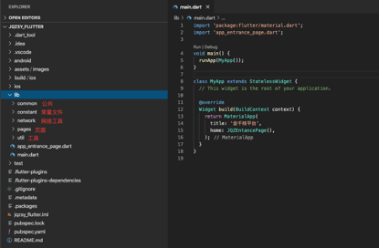

- common下有bean(公用的数据模型，如common_response等)，blocs(公用的状态状态管理)，event(公用的事件)，widget(公用的UI组件)。

- constant下放置一些常量文件，如color_constant，image_constant，router_constant。

- network下配置了网络工具类，目前配置了基础的http_request，用于一般接口请求，后续可以根据业务需求添加。

- pages下根据业务模块分为application，find，home，mine。日常的页面开发都在这个文件下。

- util下目前有dateTime_util(时间戳工具)，encryption_util(加解密工具)，log_util(日志工具)。待补充（toast等）

  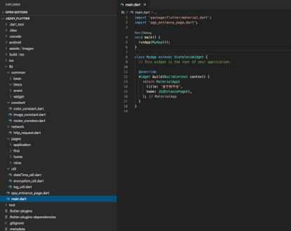


在各模块的结构中，以home为例，分别有bean, bloc, event, request, state, widgets。

这里的所有文件应该是在该模块内实现，不与其他模块耦合，仅供模块内调用。

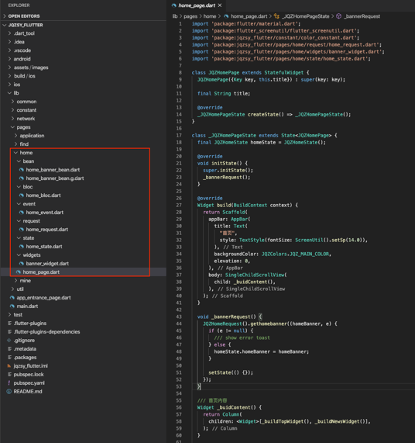

###  资源目录

在`assets`下可以存放image、font、json、xml等各种资源，在`pubspec.ymal`中声明即可使用。

Image目前有配置2.0x和3.0x。

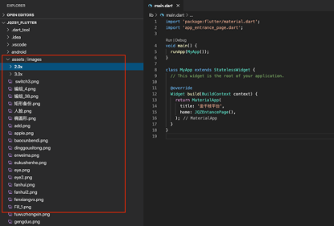

### pubspec.yaml文件

这里主要是配置项目依赖项，比如远程`pub`库，或者本地的一些资源。

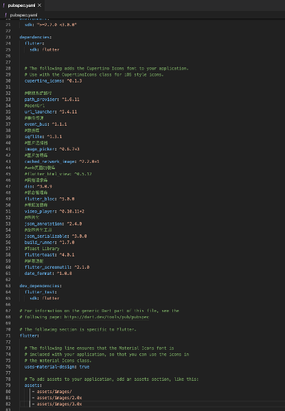

# 实战开发

项目的基础配置已经配置完毕，那如何在日常开发中使用呢？

### 资源使用

以图片为例，将要使用的图片资源分别放入assets/images、2.0x、3.0x下，因为在`pubspec`已经引入这三个文件，所以不用再重复引入。接下来在`image_constant`中添加常量文件名称。

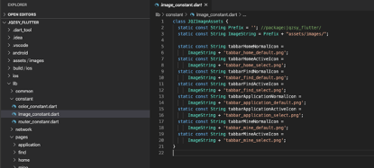

最后在使用的文件中导入头文件，就可以直接获取图片

```dart
import 'package:jqzsy_flutter/constant/image_constant.dart';

Image.asset(JQZImageAssets.tabbarHomeActiveIcon)
```

### 序列化与反序列化

在项目开发中，必不可少的就是与后端交互，后端返回的response大多是jsonString，如果直接转为Map使用也很不方便。在json转model，model转json中dart有内置的json解码器，但缺点是必须要手动解码，这样在手动编写时很容易逻辑出错从而导致程序抛出异常。所以在大型项目中一般选择自动序列化方式，可以避免人为出错，从而提高开发效率。

`Json_annotation`和`json_serializable`为Google官方提供的优秀pub库，`build_runner`则可以自动生成代码。

使用方式很简单：

1. 添加自己的业务模型，添加完毕后该class用`@JsonSerializable()`标识。
2. 手动输入“part ‘xxx.g.dart’”（注意，这里的xxx要与模型文件名称一致）。
3. 在项目根目录下运行`flutter pub run build_runner build`命令，此时项目下会有新增的.g文件。
4. 添加序列化和反序列化代码。

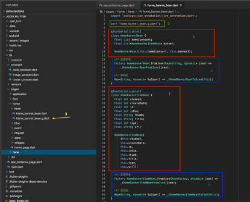

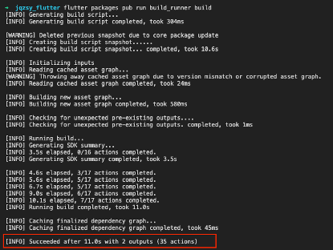

### 状态管理-BLoC

#### 为什么需要状态管理？

在我们一开始构建应用的时候，也许很简单。我们有一些状态，直接把他们映射成视图就可以了。这种简单应用可能并不需要状态管理。

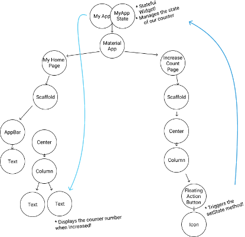

但是随着功能的增加，你的应用程序将会有几十个甚至上百个状态。这个时候你的应用应该会是这样。

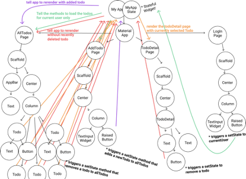

在应用越来越复杂的时候，我们的状态变得很难维护。而且涉及到多个页面共享状态时，你就需要同步多个状态。

所以需要一个状态管理框架帮我来理清关系，明确职责。

#### 状态管理框架有哪些？

Flutter中有很多优秀的状态管理框架，如**Redux**, **Provide**, **Provider**, **Bloc**。

Bloc官方地址：[https://bloclibrary.dev/](https://bloclibrary.dev/)

#### 选择BloC的原因？

状态管理的本质就是为了让界面与业务分离。界面根据**state**来显示，操作事件时发出**Action**或**Event**,业务交给**bloc**处理。

Bloc其实类似mvvm中的viewModel,负责所有业务的处理。

**flutter_bloc+bloc**库内部封装了*stream*和*RxDart*来实现BLoC，所以直接使用这个库就可以了。

Bloc可以方便的把样式与业务逻辑区分开，从而使开发更便捷，可重用性更好，测试也更加方便。

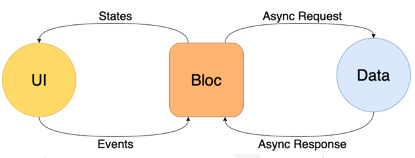

#### 如何使用BLoC?

从官方的计数器来简单实例如何使用bloc。

首先创建计数器Event,在CounterEvent中标识事件枚举类型。

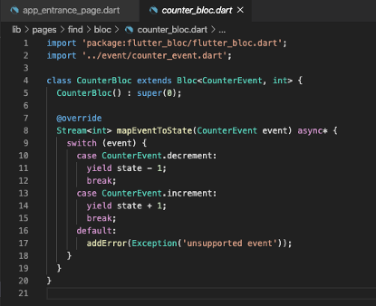

其次添加bloc文件，创建Counter继承Bloc<CounterEvent, int>，

必须实现initialState和mapEventToState方法。并在mapEventToState中做好事件对应的逻辑处理。

因为计数器较为简单，只用返回基本int类型，所以不用创建state了。

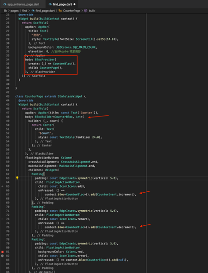

最后在UI层使用。

使用BlocProvider在需要该Bloc的Widget Tree上进行包裹，这里直接放到了整个页面上，可以根据需要放到适当的Widget Tree层级上，同时这里的BlocProvider也自动处理了CounterBloc的关闭操作，所以我们不必使用一个StatefulWidget。

 

然后就是在页面中使用BlocBuilder，我们通过扩展函数的形式或者使用BlocProvider.of(context)获取CounterBloc，然后在builder函数中，使用当前的State对象值count，并通过counterBloc对象进行事件Event变化的操作。


### 网络请求

http请求在google官方Dio库的基础上进行了二次封装，支持GET与POST两种方式。

```dart
/// request method
  //url 请求链接
  //parameters 请求参数
  //method 请求方式
  //onSuccess 成功回调
  //onError 失败回调
  static Future<bool> request<T>(String url,
      {parameters,
      headers,
      method,
      Function(T t) onSuccess,
      Function(String error) onError}) async {
    parameters = parameters ?? {};
    method = method ?? 'GET';

    /// 请求处理
    parameters.forEach((key, value) {
      if (url.indexOf(key) != -1) {
        url = url.replaceAll(':$key', value.toString());
      }
    });

    Dio dio = await createInstance(url);
    //请求结果
    var result;
    try {
      Map<String, dynamic> header = {};
      if (headers != null) {
        header.addAll(headers);
      }
      header.addAll(_configTestHeaders());

      Response response = await dio.request(url,
          data: parameters,
          options: new Options(method: method, headers: header));
      JQZLogUtil.e(
          'method - ${method} \n url - ${url} \n headers - ${headers} \n parmars - ${parameters} \n response - ${response.toString()}',
          tag: JQZLogUtil.TAG_NETWORK);
      result = jsonDecode(response.data);

      if (response.statusCode == 200) {
        if (onSuccess != null) {
          onSuccess(result);
      } else {
        throw Exception('statusCode:${response.statusCode}');
      }
      return true;
    } on DioError catch (e) {
      print('请求出错：' + e.toString());
      onError(e.toString());
      return false;
    }
  }
    
    /// 创建 dio 实例对象
  static Future<Dio> createInstance(String url) async {
    if (dio == null) {
      /// 全局属性：请求前缀、连接超时时间、响应超时时间
      var options = BaseOptions(
        connectTimeout: 15000,
        receiveTimeout: 15000,
        responseType: ResponseType.plain,
        headers: _configCommonHeaders(url),
        contentType: 'application/json; charset=utf-8',
        validateStatus: (status) {
          // 不使用http状态码判断状态，使用AdapterInterceptor来处理（适用于标准REST风格）
          return true;
        },
        baseUrl: "http://xxxx",
      );

      dio = new Dio(options);
    }

    return dio;
  }

```


```dart
/// http request methods
  static const String GET = 'get';
  static const String POST = 'post';
  static const String PUT = 'put';
  static const String PATCH = 'patch';
  static const String DELETE = 'delete';

  ///Get请求
  static Future<bool> get<T>(
    String url, {
    parameters,
    headers,
    Function(T t) onSuccess,
    Function(String error) onError,
  }) async {
    return JQZHttpRequest.request(url,
        parameters: parameters,
        headers: headers,
        method: GET,
        onSuccess: onSuccess,
        onError: onError);
  }

  ///Post请求
  static Future<bool> post<T>(
    String url, {
    parameters,
    headers,
    Function(T t) onSuccess,
    Function(String error) onError,
  }) async {
    return JQZHttpRequest.request(
      url,
      parameters: parameters,
      headers: headers,
      method: POST,
      onSuccess: onSuccess,
      onError: onError,
    );
  }
```

使用方式很简单，传递url与parameters,并且在success与error回调中处理逻辑。

# 常见三方插件

\# 网络请求框架

dio: ^3.0.7

\# sp

shared_preferences: ^0.5.6

\# 微信sdk

fluwx: ^1.2.1+1

\# swiper 轮播插件

flutter_swiper: ^1.1.6

\# 个推 sdk

getuiflut: ^0.1.6

\# Flutter 调试工具

flutter_flipperkit: ^0.0.21

\# flipper sqflite调试

flipperkit_sqflite_driver: 0.0.2

\# json生成

json_annotation: ^2.2.0

\# 下载器

flutter_downloader: 1.1.7

\# 获取系统路径

path_provider: ^1.3.0

\# 系统权限管理

permission_handler: ^4.3.0

\# 通知权限管理

notification_permissions: ^0.4.4

\# webview

flutter_webview_plugin: ^0.3.4

\# 唤起其他app

url_launcher: ^5.0.2

\# growingio 统计

flutter_growingio_track:

path: plugins/flutter_growingio_track-2.6.4

\# 设备信息

device_info: ^0.4.0

\# 生成uuid

uuid: 2.0.2

\# 事件传递

event_bus: ^1.1.0

\# loading 样式组件

flutter_spinkit: ^4.0.0

\# qq sdk

flutter_qq: ^0.0.5

\# 代码包信息

package_info: ^0.4.0+6

\# 状态管理

provider: ^3.0.0+1

\# 选择器

flutter_picker: ^1.0.13

\# 图片裁剪

image_cropper: ^1.0.2

\# 图片选择

image_picker: ^0.6.1+2

\# 路由框架

fluro: ^1.5.1

\# pdf浏览器

flutter_full_pdf_viewer: ^1.0.4

\# 避免输入框被键盘遮挡

keyboard_avoider: ^0.1.2

\# 屏幕适配 https://github.com/OpenFlutter/flutter_screenutil

flutter_screenutil: ^1.1.0

\# Toast插件 https://github.com/OpenFlutter/flutter_oktoast

oktoast: ^2.2.0

\# 日期选择器

flutter_cupertino_date_picker: ^1.0.12

\# 小红点插件 badge https://pub.dev/packages/flutter_badge

flutter_badge: ^0.0.1

\# 自定义上拉加载和下拉刷新效果 flutter_easyrefresh 前提：必须是一个ListView

flutter_easyrefresh: ^1.2.7

\# 音频播放插件: https://pub.flutter-io.cn/packages/audioplayers

audioplayers: ^0.13.2

\# 录音: https://pub.flutter-io.cn/packages/audio_recorder

audio_recorder:

path: plugins/audio_recorder-1.0.1

\# 瀑布流插件 https://github.com/letsar/flutter_staggered_grid_view

flutter_staggered_grid_view: ^0.3.0

\# 图片浏览器: https://pub.flutter-io.cn/packages/photo_view

photo_view: ^0.9.0

\# 数据加解密

encrypt: 3.3.1

\# 网络状态插件connectivity: ^0.4.8+2

connectivity: ^0.4.8+2

\# 腾讯im

dim:

path: plugins/dim

\# sql

sqflite: ^1.1.7+1

\# 富文本输入

extended_text_field: 0.4.9

\# 富文本展示

extended_text: ^0.6.6

\# 振动

vibration: 1.2.2

\# 弹出气泡

w_popup_menu: ^0.2.5

\# 高德-仅地图

amap_map_fluttify:

path: plugins/amap_map_fluttify-develop3

\# amap_map_fluttify: 0.18.2+c038d50

\# 高德-仅定位

amap_location_fluttify: 0.8.11+481e45c

\# 图片缓存

cached_network_image: 2.0.0-rc.1

\# iOS 内购

flutter_inapp_purchase: ^2.1.0

\# 获取设备id: https://pub.flutter-io.cn/packages/unique_ids

unique_ids: 1.0.10

\# 获取设备user_agent

flutter_user_agent:

path: plugins/flutter_user_agent-1.2.1

\# 颜色插件

color: 2.1.1

\# 消息上下轮播(跑马灯)

marquee: 1.3.1

\# 为SVG路径和代码生成创建一个纯Dart解析库

path_parsing: 0.1.4

\# 异常捕获及日志打印

\# https://pub.flutter-io.cn/packages/sentry

sentry: 3.0.1

\# 基于dio的网络请求日志

dio_log: ^1.3.3

\# 支付代码测试

iap_pay:

git:

 url: https://gitee.com/Steven_Hu/iap_pay.git

 ref: master

# 代码规范

1. 库、包、目录、源文件名字规则:小写加下划线[_]
    `library peg_parser.source_scanner;`
    `import 'file_system.dart';`

2. 类成员，顶级定义，变量，参数和命名参数应该大写除第一个单词之外的每个单词的第一个字母，并且不使用分隔符

   ```dart
    var item ;
    HttpRequest httpRequest ;
    void align （bool clearItems ）{ // ... }
   ```

3. 类名，枚举等应该首字母大写，并包含固定前缀，如JQZ

`class JQZBusinessPlugin {}`

`class JQZHomePage extends StatefulWidget {}`

4. 代码经常使用格式化工具，VCCode快捷键 S+C+F

5. 业务与页面分离，业务代码最好都放置在bloc中处理，少量业务的页面可以使用setState更新。Page中组件拆分，如

```dart
Widget build(BuildContext context) {

  return Scaffold(

   body: SingleChildScrollView(

​    child: _buidContent(),

   ),

  );

 }

 

Widget _buidContent() {

  return Column(

   children: <Widget>[_buildTopWidget(), _buildNewsWidget()],

  );

 }
```

# 混合开发

在搭建混合工程，最重要的就是以下两点：

对原生工程无侵入：原生工程可以增加组件的依赖，但不能修改主工程的配置，更不能让原生工程对环境产生新的依赖。

方便调试：不管是原生工程开发，调试新接入的模块（比如 Flutter），还是模块开发调试原生工程，都应该支持断点调试。

### FlutterBoost

新一代Flutter-Native混合解决方案。 FlutterBoost是一个Flutter插件，它可以轻松地为现有原生应用程序提供Flutter混合集成方案。FlutterBoost的理念是将Flutter像Webview那样来使用。在现有应用程序中同时管理Native页面和Flutter页面并非易事。 FlutterBoost帮你处理页面的映射和跳转，你只需关心页面的名字和参数即可（通常可以是URL）

### 如何集成flutterBoost

首先按照官方文档将原生工程配置flutter组件依赖，以iOS为例。

用cocopods配置对三方库的管理，然后在podfile中配置flutter地址。请注意，flutter主工程要与native工程在同一目录下。

```objective-c
# Uncomment the next line to define a global platform for your project
platform :ios, '10.0'

target 'xxx' do
  # Comment the next line if you don't want to use dynamic frameworks
  use_frameworks!

   flutter_application_path = "../app/"
   load File.join(flutter_application_path,'.ios','Flutter','podhelper.rb')
   install_all_flutter_pods(flutter_application_path)

end
```

配置完后直接执行`pod install`。

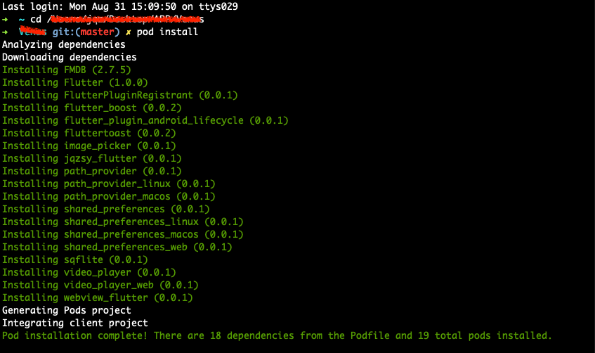

`pod install`结果显示添加的插件都已下载完毕。

这样混合开发环境就已经配置完成了。

### Flutter与iOS页面跳转

在配置好flutterBoost之后，在iOS工程创建一个flutterRouter类，然后在delegate中做flutter初始化的工作。

```objective-c
JQZFlutterRouter * router = [JQZFlutterRouter sharedRouter];
   [[FlutterBoostPlugin sharedInstance] startFlutterWithPlatform:router onStart:^(FlutterEngine *engine) {
       [JQZFlutterRouter sharedRouter].engine = engine;
}];

```

JQZFlutterRouter，内部实现打开native页面的路由代码。

```objective-c
@implementation JQZFlutterRouter

+ (instancetype)sharedRouter{
    static JQZFlutterRouter *_instance = nil;
    static dispatch_once_t onceToken;
    dispatch_once(&onceToken, ^{
        _instance = [[JQZFlutterRouter alloc] init];
        [GeneratedPluginRegistrant new]; /// 空方法占位，防止flutter初始化plugin无法注册
    });
    return _instance;
}

- (void)setEngine:(FlutterEngine *)engine {
    _engine = engine;

    [[JQZFlutterBusinessPlugin new] setupPluginsWithMessenger:engine.binaryMessenger];
    [[JQZFlutterMessageStreamHander new] setupMessageHanderWithMessenger:engine.binaryMessenger];
}

/// 跳转flutter页面
- (void)open:(NSString *)name urlParams:(NSDictionary *)params {
    [FlutterBoostPlugin open:name
                   urlParams:params
                        exts:@{@"animated":@(YES)}
              onPageFinished:^(NSDictionary *result) {
        NSLog(@"Opened %@ page%@", name, result);
    } completion:^(BOOL finish) {
    }];
}

/// Native与flutter相互跳转
- (void)open:(NSString *)name urlParams:(NSDictionary *)params exts:(NSDictionary *)exts completion:(void (^)(BOOL))completion {
    if ([name hasPrefix:@"flutterbus:"]) {//打开原生页面
        [JQZPageJumpHander open:name urlParams:params exts:exts completion:completion];
        return;
    }
    
    BOOL animated = [exts[@"animated"] boolValue];
    JQZFlutterViewController *vc = JQZFlutterViewController.new;
    [vc setName:name params:params];
    [self.navigationController pushViewController:vc animated:animated];
    if(completion) completion(YES);
}
```

这样就实现flutter与iOS原生页面相互跳转的实现。

示例：

**iOS打开flutter页面**：

```objective-c
[[JQZFlutterRouter sharedRouter] open:@"setting" urlParams:nil];
```

**Flutter打开iOS页面**：

```dart
FlutterBoost.singleton.open(

   "flutterbus://homeEditSecond",

  );
```

###  Flutter与iOS事件传递

#### Platform Channel

每个 Channel 都有一个独一无二的名字，Channel 之间通过 name 区分彼此。

Channel 使用 codec 消息编解码器，支持从基础数据到二进制格式数据的转换、解析。

Channel 有三种类型，分别是：
 `BasicMessageChannel`：用于传递基本数据
 `MethodChannel`： 用于传递方法调用，Flutter 侧调用 native 侧的功能，并获取处理结果。
 `EventChannel`：用于向 Flutter 侧传递事件，native 侧主动发消息给 Flutter。
 这三种类型比较相似，因为它们都是传递数据，实现方式也比较类似。


 flutterboost有提供的便捷使用方式：


但是flutterboost使用的通道名称为固定的flutter_boost，如果要自定义通道名称还是使用官方方法。

#### MethodChannel

在iOS工程中，新建一个JQZFlutterBusinessPlugin用于配置接收事件的处理。

```objc
@implementation JQZFlutterBusinessPlugin


///注册插件
- (void)setupPluginsWithMessenger:(NSObject<FlutterBinaryMessenger>*)messenger {

    // 用于Flutter 调用 Native
    // 这个channelname必须与Native里接收的一致 FlutterBinaryMessenger
    FlutterMethodChannel *methodChannel = [FlutterMethodChannel methodChannelWithName:methodChannelName binaryMessenger:messenger];

    [methodChannel setMethodCallHandler:^(FlutterMethodCall * _Nonnull call, FlutterResult  _Nonnull result) {
        if ([call.method isEqualToString:@"getUserInfo"]) { ///获取用户信息
            [self handleUserInfoMethodCall:call result:result];
        } else if ([call.method isEqualToString:@"getNativeTheme"]) { ///获取原生主题
            [self handleThemeMethodCall:call result:result];
        } else if ([call.method isEqualToString:@"getRequestHeader"]) { ///获取请求头
            [self handleRequestHeaderMethodCall:call result:result];
        } else if ([call.method isEqualToString:@"getMainUrl"]) { ///获取请求头
            [self handleMainUrlMethodCall:call result:result];
        }
    }];
}

- (void)handleUserInfoMethodCall:(FlutterMethodCall *)call result:(FlutterResult)result {
    if (result) {
        if([UserDefaultsFactory getLoginInfo]){
            result([UserDefaultsFactory getLoginInfo]);
        }
    }
}

```

在flutter工程中，同样也配置一样的busninessPlugin用于发起事件。

```dart
class JQZBusinessPlugin {
  Future<Map> getUserInfo() async {
    Map result;
    try {
      result = await platform.invokeMethod("getUserInfo");
    } on PlatformException catch (e) {
      result = {};
    }
    JQZLogUtil.e("getUserInfo result - ${result}", tag: '[JQZBusinessPlugin]');
    return new Map<String,dynamic>.from(result);
  }

  Future<Map> getNativeTheme() async {
    Map result;
    try {
      result = await platform.invokeMethod("getNativeTheme");
    } on PlatformException catch (e) {
      result = {};
    }
    JQZLogUtil.e("getNativeTheme result - ${result}",
        tag: '[JQZBusinessPlugin]');
    return result;
  }

}

```

主要，通道名称要保持一致。这样methodChannel就配置完成了。

使用方式：

```dart
String userInfo = await JQZBusinessPlugin().getUserInfo();
```

#### EventChannel

与MethodChannel类似，在iOS工程中添加一个MessageHander用于接收处理。

```objective-c
@implementation JQZFlutterMessageStreamHander

- (instancetype)init {
    self = [super init];
    if (self) {
        
    }
    return self;
}

- (void)setupMessageHanderWithMessenger:(NSObject<FlutterBinaryMessenger>*)messenger {
    FlutterEventChannel *eventChannel = [FlutterEventChannel eventChannelWithName:eventChannelName binaryMessenger:messenger];
    [eventChannel setStreamHandler:self];

}

- (FlutterError* _Nullable)onListenWithArguments:(id _Nullable)arguments
                                       eventSink:(FlutterEventSink)events {
    if (events) {
        events(@"Native向flutter发消息");
    }
    return nil;
}

- (FlutterError* _Nullable)onCancelWithArguments:(id _Nullable)arguments {
    return nil;
}
```

然后在flutter工程中配置对该channel的监听.

```dart
const EventChannel eventChannel = const EventChannel("jqz.flutter.io/nativeCallFlutter");
```

```dart
eventChannel.receiveBroadcastStream().listen(_onEvent, onError: _onError);
```

 

```dart
 void _onEvent(Object event) {

​    print("flutter收到Native发来消息 ${event}");

​    if (event is Map) {

​      String name = event['name'];

​      if (native_flutter_callbakcs[name] != null) {

​        native_flutter_callbakcs[name](event);

​      }

​    }

  }
```

这样就完成iOS对flutter发消息的处理。