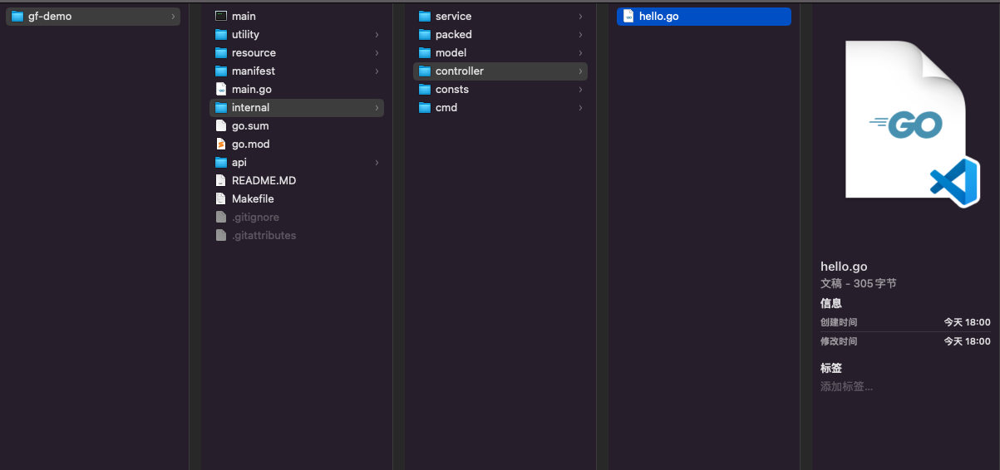

# GoFrame初见

GO作为这几年大火的轻量语言，涌入了不少优秀的开发者造出了很多优秀的框架。初次接触时，经常会在框架选择上犯愁，经朋友推荐开始接触gf，不同于gin这种轻量优雅的web server框架，goframe更适合小型团队。在整体的框架设计模块化方面已经有严格标准，另外搭配完整的中文社区帮助初学者快速入门。

项目地址: https://github.com/gogf/gf

快速开始： https://goframe.org/pages/viewpage.action?pageId=1114119

## 环境配置

```shell
❯ gf -v
GoFrame CLI Tool v2.0.6, https://goframe.org 
GoFrame Version: v2.0.6 in current go.mod 
CLI Installed At: /usr/local/bin/gf 
CLI Built Detail:
  Go Version:  go1.17.7
  GF Version:  v2.0.6
  Git Commit:  2022-03-31 16:57:32 66803fd6641e31c60f0489180668243ea092b87b
  Build Time:  2022-03-31 16:55:38 
```

请注意，我是在gf-v2.0以上版本开发的，是在今年3月才正式发布的，在网上找的很多资料都是1.x版本，导致走了很多弯路🥹 

## 创建项目

环境配置好后使用`gf init gf-demo`快速创建项目

```shell
❯ gf init gf-demo
initializing... 
initialization done!  
you can now run "cd gf-demo && gf run main.go" to start your journey, enjoy!
```

创建好的项目结构如图：



基本的MVC框架、resource、config都安排的明明白白的，不用再二次设计。

| 目录/文件名称   | 说明     | 描述                                                         |
| :-------------- | :------- | :----------------------------------------------------------- |
| `resource`      | 静态资源 | 静态资源文件。这些文件往往可以通过 资源打包/镜像编译 的形式注入到发布文件中。 |
| `manifest`      | 交付清单 | 包含程序编译、部署、运行、配置的文件。常见内容如下：         |
| `main.go`       | 入口文件 | 程序入口文件。                                               |
| `internal`      | 内部逻辑 | 业务逻辑存放目录。通过`Golang internal`特性对外部隐藏可见性。 |
| `hack`          | 工具脚本 | 存放项目开发工具、脚本等内容。例如，`CLI`工具的配置，各种`shell/bat`脚本等文件。 |
| `go.mod`        | 依赖管理 | 使用`Go Module`包管理的依赖描述文件。                        |
| `api`           | 接口定义 | 对外提供服务的输入/输出数据结构定义。考虑到版本管理需要，往往以`api/v1...`存在。 |
| ` - service`    | 接口定义 | 用于业务模块解耦的接口定义层。具体的接口实现在`logic`中进行注入。 |
| ` - model`      | 结构模型 | 数据结构管理模块，管理数据实体对象，以及输入与输出数据结构定义。 |
| ` - logic`      | 逻辑封装 | 业务逻辑封装管理，特定的业务逻辑实现和封装。往往是项目中最复杂的部分。 |
| `  - entity`    | 数据模型 | 数据模型是模型与数据集合的一对一关系，由工具维护，用户不能修改。 |
| ` - docker`     | 镜像文件 | `Docker`镜像相关依赖文件，脚本文件等等。                     |
| `  - do`        | 领域对象 | 用于`dao`数据操作中业务模型与实例模型转换，由工具维护，用户不能修改。 |
| ` - deploy`     | 部署文件 | 部署相关的文件。默认提供了`Kubernetes`集群化部署的`Yaml`模板，通过`kustomize`管理。 |
| ` - dao`        | 数据访问 | 数据访问对象，这是一层抽象对象，用于和底层数据库交互，仅包含最基础的 `CURD` 方法 |
| ` - controller` | 接口处理 | 接收/解析用户输入参数的入口/接口层。                         |
| ` - consts`     | 常量定义 | 项目所有常量定义。                                           |
| ` - config`     | 配置管理 | 配置文件存放目录。                                           |
| ` - cmd`        | 入口指令 | 命令行管理目录。可以管理维护多个命令行。                     |

然后运行项目。

```shell
❯ gf run main.go        
build: main.go 
go build -o ./main  main.go 
./main  
build running pid: 8298 
2022-06-23 18:02:10.248 [INFO] swagger ui is serving at address: http://127.0.0.1:8000/swagger/ 
2022-06-23 18:02:10.248 [INFO] openapi specification is serving at address: http://127.0.0.1:8000/api.json 
2022-06-23 18:02:10.249 [INFO] pid[8298]: http server started listening on [:8000] 

  ADDRESS | METHOD |   ROUTE    |                             HANDLER                             |           MIDDLEWARE             
----------|--------|------------|-----------------------------------------------------------------|----------------------------------
  :8000   | ALL    | /*         | github.com/gogf/gf/v2/net/ghttp.internalMiddlewareServerTracing | GLOBAL MIDDLEWARE                
----------|--------|------------|-----------------------------------------------------------------|----------------------------------
  :8000   | ALL    | /api.json  | github.com/gogf/gf/v2/net/ghttp.(*Server).openapiSpec           |                                  
----------|--------|------------|-----------------------------------------------------------------|----------------------------------
  :8000   | GET    | /hello     | gf-demo/internal/controller.(*cHello).Hello                     | ghttp.MiddlewareHandlerResponse  
----------|--------|------------|-----------------------------------------------------------------|----------------------------------
  :8000   | ALL    | /swagger/* | github.com/gogf/gf/v2/net/ghttp.(*Server).swaggerUI             | HOOK_BEFORE_SERVE                
----------|--------|------------|-----------------------------------------------------------------|----------------------------------
```

默认api配置了一个`hello`，`swagger`文档也配置了，另外配置了默认中间件`MiddlewareHandlerResponse`这个后面再说。

## 路由

常见的几种注册方式

```go
// 单个事件绑定
s.BindHandler("/test", func(r *ghttp.Request) {
		r.Response.Writeln(123)
})
```

```go
// 分组路由	
s.Group("/v1", func(group *ghttp.RouterGroup) {
})
```

```go
	// 分组路由配置
	s.Group("/v1", func(group *ghttp.RouterGroup) {

		//跨域路由，不需要登陆
		group.Group("/", func(group *ghttp.RouterGroup) {
			group.Middleware(
				middleware.Cors)
		})

		//跨域路由，需要登陆
		group.Group("/", func(group *ghttp.RouterGroup) {
			group.Middleware(middleware.Cors,
				middleware.Auth)
		})
	})
```

```go
// controller事件绑定
group.POST("/user/login", controller.User.SignIn)     // 手机号密码登陆
group.POST("/user/signUp", controller.User.SignUp)    // 注册
```

## 代码分层设计

`GoFrame`框架推荐的代码分层设计模式为三层架构设计（`3-Tier Architecture`），但在具体的实现中，对这种结构设计模式进行了一定的改进。三层架构设计能够很好地体现出软件设计"高内聚，低耦合"的设计思想。

在设计业务接口时基本分为两部分： 接口定义（`api`）和接口实现（`controller`）

基本流程看这个图就懂了


## cmd

`cmd`层负责引导程序启动，显著的工作是初始化逻辑、注册路由对象、启动`server`监听、阻塞运行程序直至`server`退出。

## api

上层`server`服务接收客户端请求，转换为`api`中定义的`Req`接收对象、执行请求参数到`Req`对象属性的类型转换、执行`Req`对象中绑定的基础校验并转交`Req`请求对象给`controller`层。

## controller

`controller`层负责接收`Req`请求对象后做一些业务逻辑校验，随后调用一个或多个`service`实现业务逻辑，将执行结构封装为约定的`Res`数据结构对象返回。

## model

`model`层中管理了所有的业务模型，`service`资源的`Input/Output`输入输出数据结构都由`model`层来维护。

## service

`service`是接口层，用于解耦业务模块，`service`没有具体的业务逻辑实现，具体的业务实现是依靠`logic`层注入的。

## logic

`logic`层的业务逻辑需要通过调用`dao`来实现数据的操作，调用`dao`时需要传递`do`数据结构对象，用于传递查询条件、输入数据。`dao`执行完毕后通过`Entity`数据模型将数据结果返回给`service`层。

## dao

`dao`层通过框架的`ORM`抽象层组件与底层真实的数据库交互。

## DAO层设计

自动化的DAO代码管理， 过工具自动化实现数据集合的`DAO`代码生成，提高生产效率。

先在config.yaml配置db信息

```yaml
# Database.
database:
  logger:
    level: "all"
    stdout: true

  default:
    link: "mysql:root:12345678@tcp(127.0.0.1:3306)/test"
    debug: true
```

进入项目根目录执行 `gf gen dao` 即可

执行成功后会在`server/internal` 自动更新`dao`和`do`

然后在server层中直接操作dao

```go
/// 发布文章
func (s *sFeed) PostArticle(ctx context.Context, in model.FeedPostActicleInput) (ou model.FeedCommonOutput, err error) {
	err = dao.Article.Transaction(ctx, func(ctx context.Context, tx *gdb.TX) error {

		_, err = dao.Article.Ctx(ctx).Data(do.Article{
			Uid:        gconv.Int(Auth().GetIdentity(ctx)),
			Title:      in.Title,
			Content:    in.Content,
			Img:        in.ImageUrl,
			State:      1,
			CreateTime: gtime.Now().TimestampMilli(),
			UpdateTime: gtime.Now().TimestampMilli(),
		}).Insert()
		return err
	})

	ou.Success = err == nil

	return
}
```

另外也避免了很多硬编码操作

```go
	err = baseModel.
		Fields(
			dao.Article.Columns().Id,
			dao.Article.Columns().Title,
			dao.Article.Columns().Content,
			dao.Article.Columns().Img,
			dao.Article.Columns().CommentNum,
			dao.Article.Columns().PraiseNum,
			dao.Article.Columns().Uid,
			dao.Article.Columns().CreateTime,
			dao.User.Columns().NickName,
			dao.User.Columns().Avatar,
		).
		OrderDesc(dao.Article.Columns().CreateTime).
		Page(in.PageNum, in.PageSize).
		Scan(&acticles)

```

