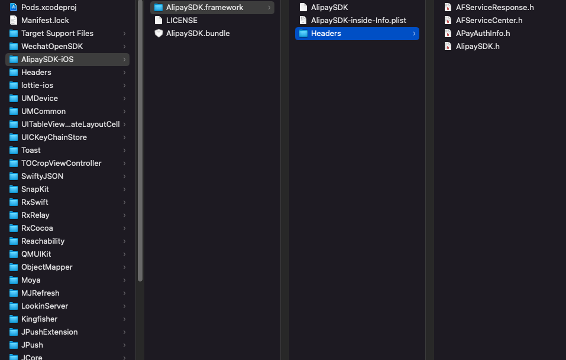
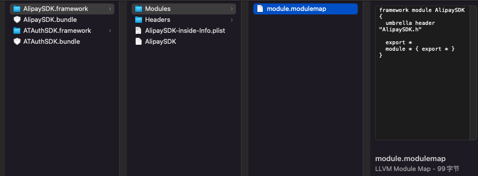

## Swift之私有Framework混编踩坑之旅

历时小半年，终于完成了公司项目OC转为Swift的重构工作，期间踩坑无数，简单来记录下印象深刻的几个问题。

基础的OC-Swift混合开发就不说了，桥接文件，如何相互调用这些网上很多人说过了。 不过还是建议可以的话最好还是纯Swift项目，Swift优秀的Struct以及Enum简直是万能，Class都已经很少用了，如果还要考虑OC调用要不就是抛弃原有优雅代码设计方案，要不就是专做一层OC调用层Class。

言归正传，在重构设计中我还是组件化方案，由于项目业务量不大，主要分为主体Host项目+其他Base私有库。纯Swfit Framework没什么好说的，就是私有的PodSpec库按流程创建就行。但问题在与有时我们私有的库会依赖外部库，这就会导致很多异常情况。

### swift framework混编情况

1、swift framework 混编引入oc 代码
2、swift framework 混编引入oc的第三方库（framework、.a）

### 解决方案

1、swift 私有库引入oc代码

​	这个其实很好解决，本质还是保证framework要经过modular，你可以看到在umbrella.h文件中会导入所有的oc头文件，使用时直接import module就ok了。另外还有一个小问题，如果OC代码中使用了协议*@protocol* 那就会在product-swift.h文件中报错`Cannot find protocol declaration for 'BMKPoiSearchDelegate'`, 这种情况就要导入使用该协议的头文件

```objc
#ifdef __OBJC__

  #import <BaiduMapAPI_Search/BMKSearchComponent.h>

  #import "xxx-Swift.h"

#endif
```

2、混编引入OC三方库

 Swift作为强类型检查的静态编译语言，可以加载动态链接库、连接到动态模块。

1）.a静态库，Swift作为强类型检查的静态编译语言，可以直接接入静态库所以问题不大。

2)  non-modular framework， 也就是没有modulemap的framework。比如AlipaySDK



使用这种库不论是dependency或是local模式，都会提示`Include of non-modular header inside framework module 'xxx':` 

想要解决其实也很简单，就是在该Framework下面建一个Modules-module.modulemap文件，当然这样的话就不能远端依赖了，必须要把文件放在本地。



最后在podspec中设置

```
s.subspec 'AliPay' do |ss|

  ss.source_files = 'xx/Classes/AliPay/*.{h,m}'

  ss.public_header_files = 'xx/Classes/AliPay/*.h'

  ss.ios.vendored_frameworks = 'xx/Classes/AliPay/*.framework'

  ss.resource = 'xx/Classes/AliPay/*.bundle'

  ss.frameworks = 'CoreMotion', 'CoreGraphics', 'CoreText', 'QuartzCore'

 end
```


### 参考

[Swift C/C++ 混编 -- module.modulemap](https://www.jianshu.com/p/691438e37df7)

[swift framework混编和蛋疼的modulemap](https://www.jianshu.com/p/aa217e070361)

[项目拆分 Cocoapods 多模块构建 framework构建 OC swift混编](https://www.jianshu.com/p/e810004aec19)