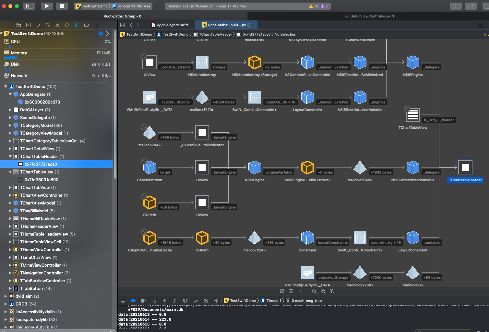
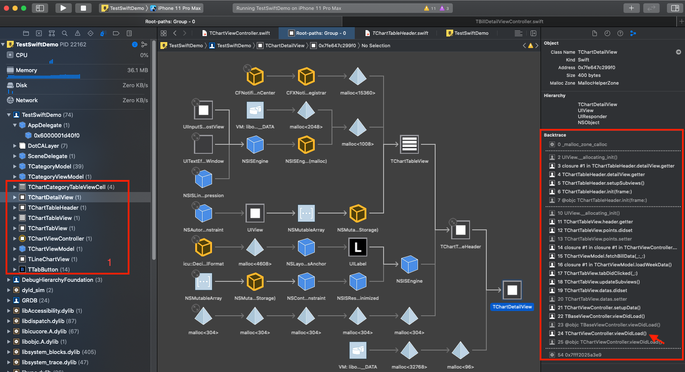
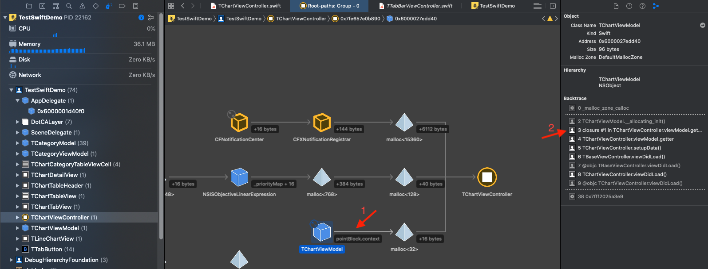
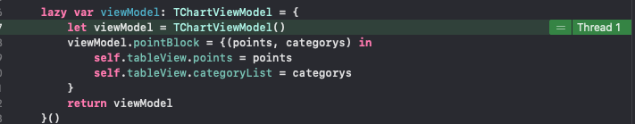
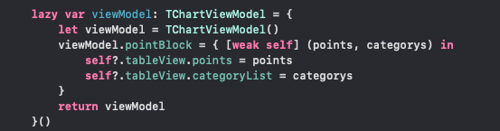
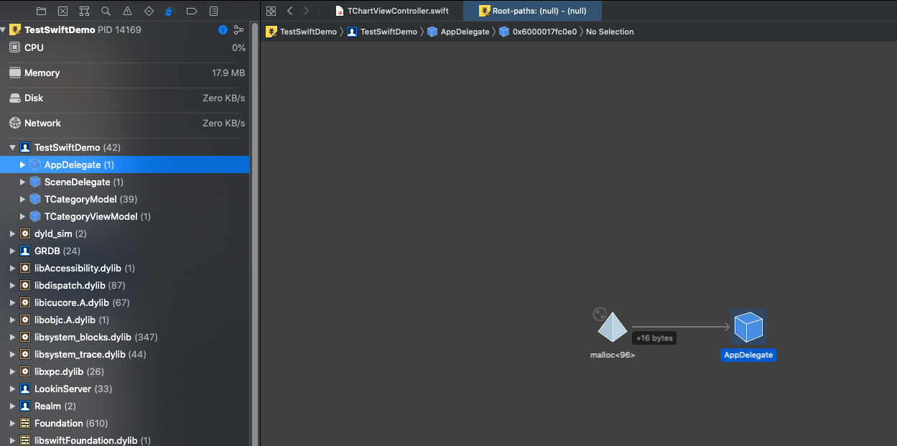
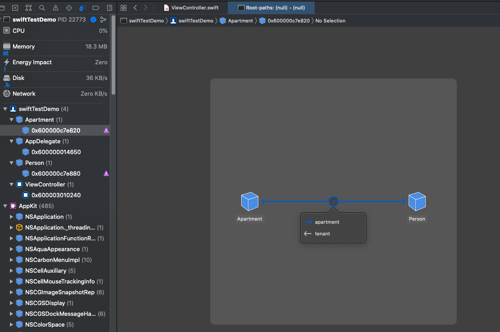

### 随手一个iOS之debug小妙招

在日常工作开发中，除了coding外，大部分时间还是在debug上。除了关键节点log外，Xcode还有很多强大的debug工具：断点、lldb、instrument、Analyze等等。最令开发者头疼的问题莫过于内存泄漏了，今天来教一个又快速又简单的查找项目中问题代码的小妙招，只需要借助memory graph即可。

Memory Graph是将运行时将内存中的对象生成分布表，可以快速帮助我们定位循环引用问题。



比如当我们收到内存异常警告时，可以通过Memory Graph查找异常原因。

但是项目简单还好说，复杂的项目中琳琅满目的内存真是让人眼花缭乱，无法很快查出泄漏问题。

**我的做法是设置一个重置小开关，将keyWindow的rootViewController设置为一个空的 UIViewController，此时在内存中存在的除了Appdelegate、SceneDelegate(iOS13 later)、以及单例对象外，其他的都是异常内存。**

上栗子！



首先第1个红框中是需要被释放却依然存在的对象，随便点开一个`TChartDetailView`，可以发现持有关系为

`TChartViewController` --> `TChartTableView` --> `TChartTableHeader` --> `TChartDetaiView`

所以，这几个对象未被释放都是因为被控制器持有，那`TChartViewController`又是因为被什么持有而未释放呢？



点开`TChartViewController`，可以看到控制器被`TChartViewModel`的`pointBlock`持有，打开memory inspector面板，跳转到closure相应的位置



果然，这里的viewModel强持有了self，那需要做weak self处理



处理过后重新Memory Graph



完美✌🏻 该释放都被释放了，现在没有内存异常问题了。而且不仅仅是闭包的循环引用，像对象间的相互持有也可以被快速发现。

像这段代码：

```swift
class Person {
    let name: String
    init(name: String) { self.name = name }
    var apartment: Apartment?
    deinit { print("\(name) is being deinitialized") }
}

class Apartment {
    let unit: String
    init(unit: String) { self.unit = unit }
    var tenant: Person?
    deinit { print("Apartment \(unit) is being deinitialized") }
}

class ViewController: NSViewController {

    var john: Person?
    var unit4A: Apartment?
    
    override func viewDidLoad() {
        super.viewDidLoad()
        
        john = Person(name: "John Appleseed")
        unit4A = Apartment(unit: "4A")
        
        john!.apartment = unit4A
        unit4A!.tenant = john
                
        john = nil
        unit4A = nil
        
        // Do any additional setup after loading the view.
    }
}
```

使用Analyze并未分析出任何问题， 但是打开Memory Graph后可以发现两个对象被相互持从而不能被释放。



将`Person` 中的`apartment`用`weak`即可解决。

Memory Graph真是太强大了，这下再也不用担心内存问题了。
